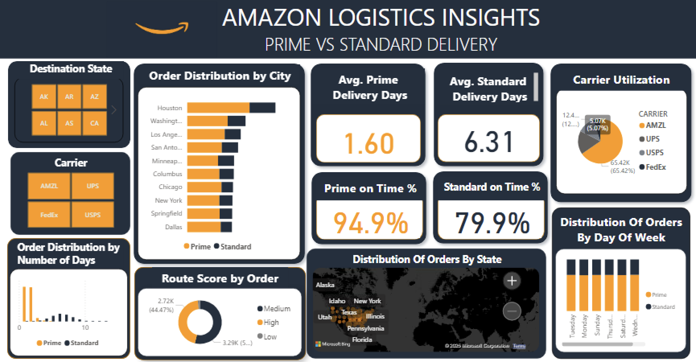

# amazon_logistics_dashboard

# Amazon Logistics Insights Dashboard – Power BI

This repository contains an interactive Power BI dashboard for analyzing Amazon logistics operations, with a focus on comparing Prime and Standard delivery performance. The dashboard enables users to monitor delivery speed, carrier utilization, order distribution, and on-time performance across states and cities.

---

## Table of Contents

- [Overview](#overview)
- [Features](#features)
- [Dashboard Layout](#dashboard-layout)
- [Contributing](#Contributing)
- [Contact](#Contact)

---

## Overview

The **Amazon Logistics Insights Dashboard** provides actionable visual analytics for Amazon order fulfillment and delivery operations. It is designed for operations managers, analysts, and e-commerce teams to optimize logistics, improve customer satisfaction, and make data-driven decisions.
 
---

## Features

- **Interactive Slicers**  
  - Filter by destination state and carrier for focused analysis.

- **Order Distribution by City**  
  - Compare Prime and Standard order volumes across major cities.

- **Delivery Performance Metrics**  
  - *Avg. Prime Delivery Days*: Track average delivery speed for Prime orders.
  - *Avg. Standard Delivery Days*: Compare with Standard delivery performance.
  - *Prime on Time %* and *Standard on Time %*: Monitor on-time delivery rates.

- **Carrier Utilization**  
  - Analyze share of shipments by carrier (AMZL, UPS, USPS, FedEx).

- **Order Distribution by Number of Days**  
  - Visualize how quickly orders are delivered for each service.

- **Route Score by Order**  
  - Assess delivery route efficiency (High, Medium, Low).

- **Geographical Insights**  
  - *Distribution of Orders by State*: Map-based visualization.
  - *Distribution of Orders by Day of Week*: Weekly patterns and on-time status.

---

## Dashboard Layout

| Section                                | Visual Type         | Description                                 |
|-----------------------------------------|---------------------|---------------------------------------------|
| Destination State, Carrier              | Button Slicers      | Interactive filtering                       |
| Order Distribution by City              | Bar Chart           | Prime vs Standard order volumes             |
| Avg. Prime/Standard Delivery Days       | Cards               | Average delivery days by service            |
| Prime/Standard On Time %                | Cards               | On-time delivery rates                      |
| Carrier Utilization                     | Donut Chart         | Share by carrier                            |
| Order Distribution by Number of Days    | Column Chart        | Delivery speed histogram                    |
| Route Score by Order                    | Donut Chart         | Route efficiency breakdown                  |
| Distribution of Orders by State         | Map                 | Geographic order spread                     |
| Distribution of Orders by Day of Week   | Stacked Bar Chart   | Orders by day and on-time status            |

---
## Contributing
Feel free to fork this repository, make improvements, and submit pull requests. Ensure any changes are documented in the `README.md`.

---
## Contact
For questions, open an issue in this repository.
